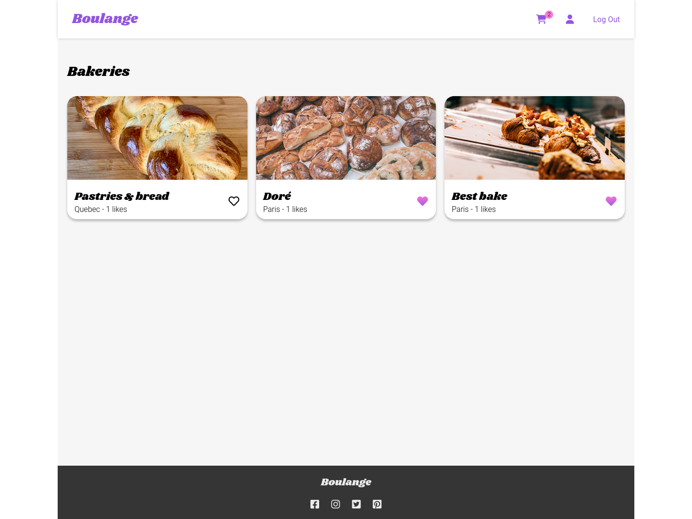

# Capstone

This is a solution to the [Capstone on CS50’s Web Programming with Python and JavaScript](https://cs50.harvard.edu/web/2020/projects/final/capstone/).

Designing and implementing a web application with Python and JavaScript.

## Table of contents

- [Overview](#overview)
  - [The application](#the-application)
  - [Screenshot](#screenshot)
  - [Links](#links)
- [Getting Started](#getting-started)
- [Technologies](#technologies)
- [License](#license)
- [Author](#author)

## Overview

### The application

Boulange web application is a Uber Eats like application for bakeries.

Users are able to:

- Register, sign in and out
- See all the available bakeries
- View the detail of a bakery

Registered users are able to:

- Add a like to their favorite bakeries
- From a bakery page, add pastries to a shopping cart
- Modify their shopping cart (update quantity, remove items) and review an order summary with total price of the cart
- Place an order and get an order id
- Review their user profile

Users belonging to the **Owner** group are able to:

- Register a new bakery (with name, description, city and an image) from their user profile
- From a bakery page:
    - Modify the bakery
    - Delete the bakery
    - Add a bakery with a name and a price

### Screenshot

[](./Screenshot_desktop.png)

[](./Screenshot_mobile.png)

### Links
huddle-landing-page-with-curved-sections-master
- Solution URL: [GitHub repo](https://github.com/mathieuc22/capstone)
- Live Site URL: [PythonAnywhere](http://mathieuc22.pythonanywhere.com/)

## Getting Started

You can run the application locally. First clone the repository from Github and switch to the new directory:

```bash
  git clone https://github.com/mathieuc22/capstone.git
  cd capstone
```

Create a virtualenv and activate it.

Install project dependencies:

```bash
pip install -r requirements.txt
```

Then simply apply the migrations:

```bash
python capstone/manage.py migrate
```

Start the server

```bash
python capstone/manage.py runserver
```

## Technologies

- [Python](https://www.python.org/)
- [JavaScript](https://developer.mozilla.org/en-US/docs/Web/JavaScript)
- [Django](https://www.djangoproject.com) - The web framework for perfectionists with deadlines.
- [Pillow](https://pillow.readthedocs.io/en/stable/) - For image management
- [Google font](https://fonts.googleapis.com) - For fonts

## License

[MIT](LICENSE)

## Author

- [@mathieuc22](https://www.github.com/mathieuc22)